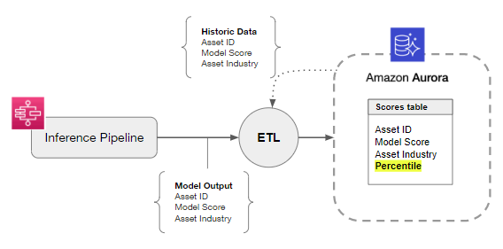

# Technical Assessment: `Lead Data Manager`

# Overview

At Memorable, we work predicting the cognitive impact of images and videos to optimize advertising strategies. Every day, our data infrastructure receives new data points in the form of model scores, which have to be properly processed before making them available to our teams. This test will evaluate your ability to develop an ETL process matching some of Memorable's current challenges.

We will simulate 20 iterations of an ETL job that seeks to compute a client-facing metric based on our models' output. We will give you a sequence of 20 batches with asset ids and their scores. You are tasked with building a pipeline that receives the sequence of batches as an input, reads them in order, and at each iteration transforms scores into `percentiles` according to the distribution of scores seen up until that point.

### Extraction
Under the `batches/` directory you will find 20 batches of scored assets (400 assets per batch) in JSON format that simulate 20 extraction jobs from our deployed inference pipeline.

Each item in the batch will include the following data:

- `id` : a ULID identifying the scored asset
- `score` : represents the score assigned to each asset by our machine learning models
- `industry` : represents the industry to which that asset belongs. Can be one of 
    - Clothing
    - Food
    - Cars
    - Hair care

Data is being extracted without any preprocessing step, so you can assume you are working with a raw version.

The batches are being extracted without any preprocessing step, so you can assume that you are working with the raw version of the data.

### Transformation

The raw score of an asset is usually hard to interpret without context: different industries can have different raw score ranges, and advertising trends can affect those ranges. To make our scores more interpretable, we want to convert them to percentiles, giving the user an immediate view over how a given score compares to a reference distribution.

From previous analyses, our team has identified that the typical scores from the four industries above follow normal distributions with different parameters. This means that transforming a given score into a percentile **must be done using the distribution of the asset's industry**, and not with the distribution of all assets available.

Moreover, we have also identified certain design trends in the uploaded assets that bias the model scores and cause an incremental drift in its output, resulting in assets scored later having higher scores than older assets. To account for this, all scores should be converted to percentiles based on distributions that include only the data belonging to the last 3 batches of scored assets.

>## Percentile computation
>
>A `percentile` is computed based on the set of `scores` in the last 3 batches (including current batch) that belong to the same `industry`.

Note that this computation will happen every time a new batch is loaded. To address cold start issues, begin the percentile computation when you have enough batches to build an initial distribution (3 batches).

### Loading

You are expected to iterate over all the batches and progressively store their results in a single SQL table with the following schema:

- `id` : column to store the asset IDs, which uniquely identify each asset processed.
- `score` : column to store the model's output for that asset
- `industry` : column to store the asset's industry
- `percentile` : the most updated version of the score’s percentile at each iteration, following the indications in the previous section to compute its value.

To increase traceability on the evolution of the scores' drift, a second table should be maintained to keep track of how the percentiles for each asset and the underlying distributions change over time. We leave up to you the design of a convenient monitoring setup that allows to query for past percentiles for a given asset `id` as well as any other relevant information you find useful.

# Conceptual assessment

In a realistic setting, we have an inference pipeline (which can be modelled as an AWS StepFunction execution) that writes score results directly into an AWS Aurora SQL database for each processed image or video in the database. In turn, each asset has an associated industry (same ones used in the exercise) for which we compute all available scores and, thus, a score distribution. With this setting:

1. How would you deploy an ETL pipeline that reads data from the SQL database and computes, for each asset, its score’s percentile based on the corresponding industry’s distribution?
2. How would design a monitoring system to track:
    1. Distribution drifts in the data
    2. The growth of the `Scores` table

*Feel free to include any diagrams you find useful to answer these questions.*

# Delivery

Please fork this repository to prevent overwriting the task’s description.

**You will have 24 hrs since you receive this test to complete it**. Once the task is completed, please push to a Github repository and make sure to add the following users as collaborators:

- [JHevia23](https://github.com/JHevia23)
- [ppfreitas](https://github.com/ppfreitas)
- [cfosco](https://github.com/cfosco)

and notify by email to your recruitment contact. As part of the deliverable, you are expected to share:

- a Python implementation of the `Extraction` , `Transformation` and `Loading` stages
- Tables requested in the task, stored in a convenient file format (*parquet* file , *csv* , *DB file* or other)
- Conceptual assessment answers in a format you find most suitable (Google Docs, Slides presentation, Markdown or other)

In case you have any questions, email [juan.hevia@memorable.io](juan.hevia@memorable.io).

# Evaluation criteria

We take a holistic approach to evaluation and these are the main components:

- `Effectiveness` : whether the delivered development tackles the proposed task and the output matches expected results.
- `Efficiency` : whether the delivered development follows recommended practices for software development and standard technologies are used.
- `Documentation`: clear documentation and commented code account for a significant part of the evaluation. It will also allow us to understand your thought process better and consider it as part of our evaluation criteria.